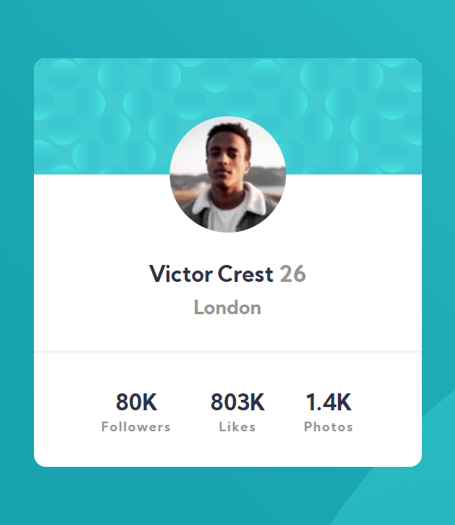
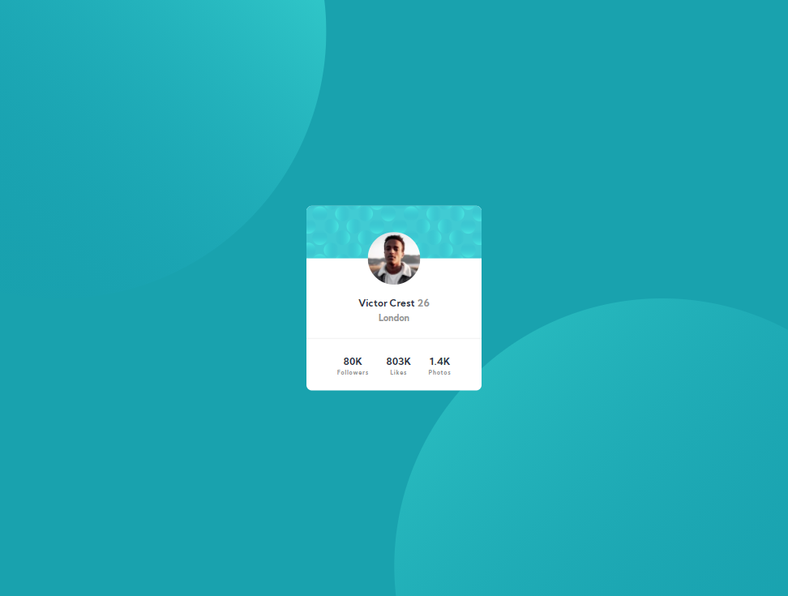

# Frontend Mentor - 3-column preview card component solution

This is a solution to the [Profile card component challenge on Frontend Mentor](https://www.frontendmentor.io/challenges/profile-card-component-cfArpWshJ). Frontend Mentor challenges help you improve your coding skills by building realistic projects. 

## Table of contents

- 
  - [The challenge](#the-challenge)
  - [Screenshot](#screenshot)
  - [Links](#links)
- [My process](#my-process)
  - [Built with](#built-with)
  - [What I learned](#what-i-learned)
  - 

### The challenge

- Build out the project to the designs provided

### Screenshot

### Links

- Solution URL: [https://github.com/TSPraneeth/profile-card-component]
- Live Site URL: [https://tspraneeth.github.io/profile-card-component/]

## My process

### Built with

- Semantic HTML5 markup
- CSS custom properties
- CSS FlexBox
- CSS Grid
- Mobile-first workflow

### What I learned

Learnt to center items using flex and also that two backgrounds can be used.